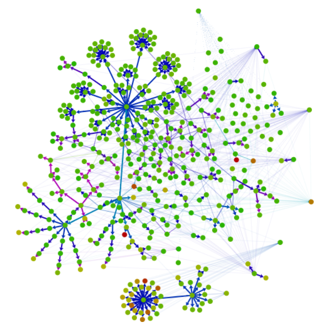

# Webpack is Awesome

Note:

I think Webpack is an awesome tool, but not enough people know it. I want to change that.


## Who am I

Daniel ([@unindented](https://twitter.com/unindented))

Front-end developer at Yammer


## What is Webpack

- Module bundler <!-- .element: class="fragment" -->
- Understands CJS and AMD <!-- .element: class="fragment" -->
- Creates one or many bundles <!-- .element: class="fragment" -->
- Treats every asset as a module <!-- .element: class="fragment" -->
- Gives you hooks to transform modules <!-- .element: class="fragment" -->
- Gives you hooks into the bundling process <!-- .element: class="fragment" -->
- Much more! <!-- .element: class="fragment" -->

Note:

Webpack is a module bundler, in the lines of [RequireJS](http://requirejs.org/) and [Browserify](http://browserify.org/), but it is much better suited for big projects.

The main differences with those other tools are:

- It handles both CommonJS and AMD syntaxes (plus ES6 modules through loaders).
- It allows you to split the dependency tree into chunks loaded on demand.
- It can extract dependencies that are common to multiple entry points into their own chunk.
- It can treat any asset as a requireable module, and transform it, through the use of loaders.
- It allows you to customize almost every part of the bundling process through plugins.


- Docs: [webpack.github.io/docs/](http://webpack.github.io/docs/)
- Examples: [github.com/.../examples](https://github.com/webpack/webpack/tree/master/examples)

Note:

The docs are really dense, but they are not bad. You just need to spend time with them.

The examples are useful once you understand the underlying concepts.


## Single Entry

Note:

Simplest example: an app with a single entry point.


```javascript
module.exports = {
  greet: function (name) {
    return 'Hello ' + name;
  }
};
```

`greeter.js`


```javascript
var greeter = require('./greeter');
console.log(greeter.greet('John'));
```

`entry.js`


Via command line:

```bash
$ webpack entry.js output/bundle.js
```


... or via config:

```javascript
module.exports = {
  entry: './entry',

  output: {
    path: 'output',
    filename: 'bundle.js'
  }
};
```

`webpack.config.js`

Note:

Keeping things in a configuration file is the way to go for non-trivial setups.

If your config file is called `webpack.config.js` you don't even have to specify the `--config` parameter to `webpack`.


```bash
$ webpack && node output/bundle.js
Hash: e7789bda0fc57a510df7
Version: webpack 1.4.15
Time: 28ms
    Asset  Size  Chunks             Chunk Names
bundle.js  1732       0  [emitted]  main
   [0] ./entry.js 72 {0} [built]
   [1] ./greeter.js 81 {0} [built]
Hello John
```

Note:

The runtime overhead compared to Browserify and RequireJS:

- **Webpack**: 243b + 20b per module + 4b per dependency
- **Browserify**: 14.7kb + 0b per module + (3b + X) per dependency
- **RequireJS**: 415b + 25b per module + (6b + 2X) per dependency


## Multiple Entries

Note:

Next step: an app with multiple entry points. Think <https://twitter.com/>, <https://twitter.com/settings/account>, etc.


```javascript
var greeter = require('./greeter');
console.log(greeter.greet('John'));
```

`entry1.js`


```javascript
var greeter = require('./greeter');
console.log(greeter.greet('Jane'));
```

`entry2.js`


```javascript
module.exports = {
  entry: {
    entry1: './entry1',
    entry2: './entry2'
  },

  output: {
    path: 'output',
    filename: 'bundle-[name].js'
  }
};
```


```bash
$ webpack
Hash: a4659d84e3692cf36938
Version: webpack 1.4.15
Time: 31ms
           Asset  Size  Chunks             Chunk Names
bundle-entry2.js  1732       0  [emitted]  entry2
bundle-entry1.js  1732       1  [emitted]  entry1
   [0] ./entry1.js 72 {1} [built]
   [0] ./entry2.js 72 {0} [built]
   [1] ./greeter.js 81 {0} {1} [built]
```

Note:

Webpack outputs a `bundle-entry1.js` containing `entry1.js` plus `greeter.js`, and a `bundle-entry2.js` containing `entry2.js` plus `greeter.js`. The number between curly braces (e.g. `{1}`) tells you which chunks contain that module.

This is not a good solution for a web application, as a user will probably hit multiple entry points in a session, and would have to download common dependencies multiple times.


```javascript
module.exports = {
  entry: {
    entry1: './entry1',
    entry2: './entry2'
  },

  output: {
    path: 'output',
    filename: 'bundle-[name].js'
  },

  plugins: [
    new CommonsChunkPlugin('common', 'bundle-[name].js')
  ]
};
```

`webpack.config.js`


```bash
$ webpack
Hash: 75ef3309e9d1f1110c46
Version: webpack 1.4.15
Time: 30ms
           Asset  Size  Chunks             Chunk Names
bundle-entry2.js   172       0  [emitted]  entry2
bundle-entry1.js   172       1  [emitted]  entry1
bundle-common.js  3842       2  [emitted]  common
   [0] ./entry1.js 72 {1} [built]
   [0] ./entry2.js 72 {0} [built]
   [1] ./greeter.js 81 {2} [built]
```

Note:

The `CommonsChunkPlugin` plugin identifies dependencies that are shared among the entry points, and puts them into their own chunk. You end up with `bundle-entry1.js` containing `entry1.js`, `bundle-entry2.js` containing `entry2.js`, and `bundle-common.js` containing `greeter.js`.

In this simple example it may seem overkill, but when you are depending on huge libraries, like jQuery, Moment or Angular, it is totally worth it.


## Module Resolution

Note:

Having to specify paths to dependencies can be a pain, specially when you have to move things around. Webpack allows you to tweak how modules are resolved.


```javascript
var greeter = require('greeter');
console.log(greeter.greet('John'));
```

`entry.js`


```javascript
module.exports = {
  entry: './entry',

  output: {
    path: 'output',
    filename: 'bundle.js'
  },

  resolve: {
    modulesDirectories: [
      'utils',
      'web_modules',
      'node_modules'
    ]
  }
};
```

`webpack.config.js`

Note:

Webpack will try to find your dependency in those directories.


```bash
$ webpack && node output/bundle.js
Hash: 23fc5041a118a3dbc1ee
Version: webpack 1.4.15
Time: 34ms
    Asset  Size  Chunks             Chunk Names
bundle.js  1732       0  [emitted]  main
   [0] ./entry.js 70 {0} [built]
   [1] ./utils/greeter.js 81 {0} [built]
Hello John
```


## Loaders

Note:

It's pretty common to apply transformations to modules. Think CoffeeScript to JavaScript, or Less to CSS. That's the job of loaders.


```coffeescript
module.exports =
  greet: (name) ->
    return "Hello #{name}"
```

`greeter.coffee`


Inlined:

```javascript
var greeter = require('coffee!./greeter');
console.log(greeter.greet('John'));
```

`entry.js`


... or via config:

```javascript
var greeter = require('./greeter');
console.log(greeter.greet('John'));
```

`entry.js`


```javascript
module.exports = {
  entry: './entry',

  output: {
    path: 'output',
    filename: 'bundle.js'
  },

  module: {
    loaders: [
      { test: /\.coffee$/, loader: 'coffee' }
    ]
  },

  resolve: {
    extensions: ['', '.coffee', '.js']
  }
};
```

`webpack.config.js`

Note:

We are telling Webpack that all files ending with `.coffee` should go through the `coffee` loader. We are also telling it to try the `.coffee` extension when resolving modules.

Much better than inlining, as all your configuration is in one place, so it's much easier to change things.


```bash
$ webpack && node output/bundle.js
Hash: b99cec921bbe2d10542d
Version: webpack 1.4.15
Time: 70ms
    Asset  Size  Chunks             Chunk Names
bundle.js  1731       0  [emitted]  main
   [0] ./entry.js 72 {0} [built]
    + 1 hidden modules
Hello John
```


### HTML, CSS, Assets

Note:

Loaders can help you with much more than transforming CoffeeScript to JavaScript.


```css
body {
  background: transparent url('./bg.png') repeat;
}
```

`styles.css`


```javascript
module.exports = {
  module: {
    loaders: [
      {
        test: /\.(gif|jpe?g|png)$/,
        loader: 'url?limit=10000'
      },
      {
        test: /\.css$/,
        loader: 'style!css'
      },
      {
        test: /\.less$/,
        loader: 'style!css!less?strictMath'
      }
    ]
  }
};
```

`webpack.config.js`

Note:

You can use the `file` and `url` loaders to process assets like images. The `url` loader is just like `file`, but allows you to inline dependencies under certain conditions.

The `html` and `css` loaders are able to identify dependencies in HTML files (e.g. ``) and CSS files (e.g. `background-image: url('bar.png')`) respectively.

CSS files need to go through yet another loader, `style`, to be injected into the head of the HTML document.


```javascript
module.exports = {
  module: {
    loaders: [
      {
        test: /\.css$/,
        loader: ExtractTextPlugin.extract('style', 'css')
      }
    ]
  },

  plugins: [
    new ExtractTextPlugin('bundle.css')
  ]
};
```

`webpack.config.js`

Note:

If you want to extract CSS content into its own file, you can use the `ExtractTextPlugin` plugin.


```bash
$ webpack
Hash: f379bf0455c6069d7446
Version: webpack 1.4.15
Time: 200ms
    Asset  Size  Chunks             Chunk Names
bundle.js  2144       0  [emitted]  main
 main.css   512       0  [emitted]  main
   [0] ./entry.js 224 {0} [built]
   [1] ./greeter.js 81 {0} [built]
    + 7 hidden modules
Child extract-text-webpack-plugin:
        + 3 hidden modules
Child extract-text-webpack-plugin:
        + 2 hidden modules
```


### Busting Caches


```javascript
module.exports = {
  entry: './entry',

  output: {
    path: 'output',
    filename: '[name]-[hash].js',
    chunkFilename: '[name]-[id]-[chunkhash].js'
  },

  plugins: [
    new ExtractTextPlugin('[name]-[contenthash].css')
  ]
};
```

`webpack.config.js`


```bash
Hash: 79eade7734f974b46524
Version: webpack 1.4.15
Time: 192ms
                                    Asset  Size  Chunks
             main-79eade7734f974b46524.js  2144       0
main-3ddaac796ef046d7c9b226ac20da330b.css   512       0
   [0] ./entry.js 224 {0} [built]
   [1] ./greeter.js 81 {0} [built]
    + 7 hidden modules
Child extract-text-webpack-plugin:
        + 3 hidden modules
Child extract-text-webpack-plugin:
        + 2 hidden modules
```

Note:

You even have cache-busting hashes built in.


### Pre/Post Loaders


```javascript
module.exports = {
  module: {
    preLoaders: [{
      test:    /\.js$/,
      exclude: /(node_modules)\//,
      loader:  'jshint!jscs'
    }],

    postLoaders: [{
      test:    /\.js$/,
      exclude: /(test|node_modules)\//,
      loader:  'istanbul-instrumenter'
    }]
  }
};
```

`webpack.config.js`

Note:

You can also specify pre- and post-loaders. Here we'd be running our JavaScript files through two linting libraries, and through a code instrumenting library.

The order in which loaders are applied is the following:

- The file is read from the filesystem
- `module.preLoaders` are applied
- `module.loaders` are applied
- Inlined loaders are applied
- `module.postLoaders` are applied


## Plugins


```javascript
var t = require('./translator');

module.exports = {
  greet: function (name) {
    return t(__('greeting'), {name: name});
  }
};
```

`greeter.js`

Note:

Plugins allow us to hook into different phases of the bundling process. For example, the `I18nPlugin` plugin replaces occurrences of the `\_\_` function with strings from a dictionary (e.g. `__("Hello World")` is replaced with `"Hello World"` or `"Hola Mundo"`, depending on the current locale).


```javascript
var greeter = require('./greeter');
if (DEBUG) {
  console.log('Greeting in "%s"', LANGUAGE);
}
console.log(greeter.greet('John'));
```

`entry.js`

Note:

The `DefinePlugin` plugin allows us to define free variables, like `DEBUG` and `LANGUAGE`. The value of those variables is specified in the config file.


```javascript
var langs = {
  en: require('./languages/en.json'),
  es: require('./languages/es.json')
};
```

`webpack.config.js`


```javascript
module.exports = Object.keys(langs).map(function (l) {
  return {
    entry: './entry',

    output: {
      path: 'output',
      filename: 'bundle-' + l + '.js'
    },

    plugins: [
      new DefinePlugin({
        DEBUG: !!process.env.DEBUG,
        LANGUAGE: '"' + l + '"'
      }),
      new I18nPlugin(langs[l])
    ]
  };
});
```

`webpack.config.js (continued)`

Note:

We are generating a bundle for each of the languages in the `langs` object, storing the language code in the `LANGUAGE` variable.

We are also defining the value of `DEBUG` through an environment variable.


```bash
$ DEBUG=true webpack && node output/bundle-es.js
Hash: ee58c1b0671117477901e05a75f21919ca322975
Version: webpack 1.4.15
...
Greeting in "es"
Hola John
```

Note:

When we bundle the app with the `DEBUG` environment variable set to `true`, we see the debugging statement.


```javascript
// ...
function(module, exports, __webpack_require__) {
  var greeter = __webpack_require__(1);
  if (true) {
    console.log('Greeting in "%s"', ("en"));
  }
  console.log(greeter.greet('John'));
},
// ...
```

`bundle.js`

Note:

The `DEBUG` variable got replaced with `true`.


```bash
$ webpack -p && node output/bundle-es.js
Hash: 59ade9c7a4dd53e1e2cc2879e3ba1f8c6b79eea5
Version: webpack 1.4.15

WARNING in (undefined) bundle-en.js from UglifyJs
Condition always false [./entry.js:2,0]
Dropping unreachable code [./entry.js:3,0]

WARNING in (undefined) bundle-es.js from UglifyJs
Condition always false [./entry.js:2,0]
Dropping unreachable code [./entry.js:3,0]
...
Hola John
```

Note:

If we don't specify the `DEBUG` environment variable, the condition in the `if` statement is always false. That's why the whole block gets dropped by UglifyJS when we enable optimizations with the `-p` flag, and we don't see the debugging statement in the output.


## Contexts


```javascript
require('./lib/' + name + '.js');
```

Note:

A context is created if your request contains expressions, so the exact module is not known at compile time.


```javascript
var req = require.context('./lib', true, /^\.\/.*\.js$/);
var libs = req.keys();
var lib = libs[Math.floor(Math.random() * libs.length)];
console.log(req(lib).foo());
```

`entry.js`

Note:

You can also create contexts by hand through the `require.context` function.

Here we are using that functionality to require a random module from the `lib` folder.


```bash
$ webpack
Hash: d0078b76688772738490
Version: webpack 1.4.15
Time: 38ms
    Asset  Size  Chunks             Chunk Names
bundle.js  2631       0  [emitted]  main
   [0] ./entry.js 167 {0} [built]
   [1] ./lib ^\.\/.*\.js$ 193 {0} [built]
   [2] ./lib/a.js 63 {0} [optional] [built]
   [3] ./lib/b.js 63 {0} [optional] [built]
   [4] ./lib/c.js 63 {0} [optional] [built]
```

Note:

Webpack includes all modules matching our regular expression in the bundle.


```bash
$ node output/bundle.js
c
$ node output/bundle.js
b
```

Note:

At runtime it does the right thing.


**Why would anyone want to do this?**

* Require resource based on locale <!-- .element: class="fragment" -->
* Require all components to build a gallery <!-- .element: class="fragment" -->


### Context Replacement


```javascript
var moment = require('moment');
console.log(moment().format('dddd'));
```

`entry.js`

Note:

Some third-party libraries, like Moment, also create contexts when processed through Webpack.


```bash
$ webpack
Hash: 3fa34cb738076f531876
Version: webpack 1.4.15
Time: 396ms
    Asset    Size  Chunks             Chunk Names
bundle.js  393777       0  [emitted]  main
   [0] ./entry.js 70 {0} [built]
    + 81 hidden modules
```

Note:

Why is the bundle so big?


```javascript
function loadLocale(name) {
  var oldLocale = null;
  if (!locales[name] && hasModule) {
    try {
      oldLocale = moment.locale();
      require('./locale/' + name);
      moment.locale(oldLocale);
    } catch (e) { }
  }
  return locales[name];
}
```

`moment.js`

Note:

Webpack is creating a context and including all locales in the bundle.


```javascript
module.exports = {
  entry: './entry',

  output: {
    path: 'output',
    filename: 'bundle.js'
  },

  plugins: [
    new ContextReplacementPlugin(
      /moment[\\\/]locale$/,
      new RegExp('^\\./en$')
    )
  ]
};
```

`webpack.config.js`

Note:

We can use the `ContextReplacementPlugin` plugin to manipulate the context. Here, we are only including the English locale.


```bash
$ webpack
Hash: d6a652b194a14ca3d0a6
Version: webpack 1.4.15
Time: 141ms
    Asset    Size  Chunks             Chunk Names
bundle.js  101653       0  [emitted]  main
   [0] ./entry.js 70 {0} [built]
    + 3 hidden modules
```

Note:

The resulting bundle is much smaller, because we've left all other locales out.


## Load On Demand

Note:

If your app is big, you may want to load some things on demand, rather than upfront. You can do so through `require.ensure` if you are using CommonJS syntax, or `require` if you are using AMD syntax.

`require.ensure` does not evaluate the module. `require` does.


```javascript
var a = require('./a');
var p = function () {
  console.log(arguments);
};

a.foo(p);
a.bar(p);
```

`entry.js`


```javascript
module.exports = {
  foo: function (callback) {
    callback('foo');
  },
  bar: function (callback) {
    require.ensure(['./b'], function (require) {
      require('./b').bar(callback);
    });
  }
};
```

`a.js`

Note:

Calling `require.ensure` here will create a split point that will put `b` into its own chunk. This chunk will be loaded on demand when the `bar` method is called.


```javascript
module.exports = {
  bar: function (callback) {
    callback('bar');
  }
};
```

`b.js`


```bash
$ webpack
Hash: 0b184470f56d6ed09471
Version: webpack 1.4.15
Time: 31ms
      Asset  Size  Chunks             Chunk Names
  bundle.js  4098       0  [emitted]  main
1.bundle.js   180       1  [emitted]
   [0] ./entry.js 96 {0} [built]
   [1] ./a.js 203 {0} [built]
   [2] ./b.js 76 {1} [built]
```

Note:

You can see that `b` has been split into its own chunk.


```bash
$ webpack-dev-server
$ open http://localhost:8080/bundle
```

Note:

You can see this in action by launching `webpack-dev-server`.


## Dev Server

Note:

The `webpack-dev-server` is a little `express` server, which uses the `webpack-dev-middleware` to serve a bundle.


```bash
http://localhost:8080/webpack-dev-server/
webpack result is served from /
content is served from /Users/dalvarez/Dropbox/Work/webpack-presentation/examples/extract-css/output
Hash: ff994e08f6f3c9c9ad45
Version: webpack 1.4.15
Time: 196ms
  Asset   Size  Chunks             Chunk Names
main.js  11484       0  [emitted]  main
chunk    {0} main.js (main) 10032 [rendered]
    [0] ./entry.js 224 {0} [built]
    [1] ./greeter.js 81 {0} [built]
    [2] ./foo.css 1287 {0} [built]
    [3] ./~/css-loader!./foo.css 317 {0} [built]
    [4] ./bar.less 1638 {0} [built]
    [5] ./~/css-loader!./~/less-loader?strictMath!./bar.less 267 {0} [built]
    [6] ./~/style-loader/addStyles.js 5513 {0} [built]
    [7] ./~/css-loader/cssToString.js 352 {0} [built]
    [8] ./bg.png 353 {0} [built]
webpack: bundle is now VALID.
```


```bash
webpack: bundle is now INVALID.
Hash: 310f70e6bd37497bc186
Version: webpack 1.4.15
Time: 12ms
  Asset   Size  Chunks             Chunk Names
main.js  11483       0  [emitted]  main
chunk    {0} main.js (main) 10031 [rendered]
    [4] ./bar.less 1638 {0} [built]
    [5] ./~/css-loader!./~/less-loader?strictMath!./bar.less 266 {0} [built]
     + 7 hidden modules
webpack: bundle is now VALID.
```

Note:

When you make a change, `webpack-dev-middleware` will recompile only the modules that are affected by it.


```bash
$ webpack-dev-server --hot
```

Note:

If you run `webpack-dev-server` with hot module replacement enabled, you can inject your changes into the runtime as you make them.


```bash
webpack: bundle is now INVALID.
Hash: 3fec1bd53dcd5db963b5
Version: webpack 1.4.15
Time: 21ms
                               Asset    Size  Chunks
                             main.js  141697       0
0.67e20f0d56fd82d86a5d.hot-update.js     271       0
67e20f0d56fd82d86a5d.hot-update.json      36
chunk    {0} main.js, 0.67e20f0d56fd82d8.hot-update.js
    [8] ./bar.less 1638 {0} [built]
    [9] ./~/css-loader!./~/less-loader!./bar.less
     + 13 hidden modules
webpack: bundle is now VALID.
```


## Circular Dependencies

Note:

Circular dependencies are handled the same way as in Node.js.

When you create a loop in the dependency graph, the requiring module will get a reference to an incomplete `module.exports` from the required module. If you are adding properties by doing `module.exports.foo = ...`, the incomplete object will receive them eventually. But if you declare your exports by doing `module.exports = ...`, you will be creating a new object which the requiring module has no way to access.


```javascript
var a = require('./a');
var b = require('./b');
console.log(a.foo(), a.bar());
console.log(b.foo(), b.bar());
```

`entry.js`


```javascript
var b = require('./b');

module.exports = {
  foo: function () {
    return 'foo';
  },
  bar: function () {
    return b.bar();
  }
};
```

`a.js`


```javascript
var a = require('./a');

module.exports = {
  foo: function () {
    return a.foo();
  },
  bar: function () {
    return 'bar';
  }
};
```

`b.js`


```bash
$ webpack && node output/bundle.js
Hash: 2a025268ca2ec2599e02
Version: webpack 1.4.15
Time: 27ms
    Asset  Size  Chunks             Chunk Names
bundle.js  2081       0  [emitted]  main
   [0] ./entry.js 110 {0} [built]
   [1] ./a.js 136 {0} [built]
   [2] ./b.js 136 {0} [built]
foo bar

.../examples/loop-cjs/output/bundle.js:77
      return a.foo();
               ^
TypeError: Object #<Object> has no method 'foo'
```

Note:

At that point, `a` is an empty object.


```javascript
module.exports = {
  foo: function () {
    return 'foo';
  },
  bar: function () {
    return require('./b').bar();
  }
};
```

`a.js`


```javascript
module.exports = {
  foo: function () {
    return require('./a').foo();
  },
  bar: function () {
    return 'bar';
  }
};
```

`b.js`

Note:

One possible solution is to defer the calls to `require`.

We could also move our `module.exports` statement above the `require` calls.


```bash
$ webpack && node output/bundle.js
Hash: c35dab70ede7e0f1b348
Version: webpack 1.4.15
Time: 28ms
    Asset  Size  Chunks             Chunk Names
bundle.js  2055       0  [emitted]  main
   [0] ./entry.js 110 {0} [built]
   [1] ./a.js 124 {0} [built]
   [2] ./b.js 124 {0} [built]
foo bar
foo bar
```


## Dependency Visualization

<http://webpack.github.io/analyse/> <!-- .element: class="fragment" -->

Note:

We can output stats from the bundling process, and query the information.

The *analyse* tool draws a pretty graph of all the modules, and gives us all sorts of useful details.





## Much More

* Source maps <!-- .element: class="fragment" -->
* Ignore dependencies <!-- .element: class="fragment" -->
* Dedupe dependencies <!-- .element: class="fragment" -->
* Loaders for every format <!-- .element: class="fragment" -->


## Questions?

<https://unindented.github.io/webpack-presentation/> <!-- .element: class="fragment" -->
